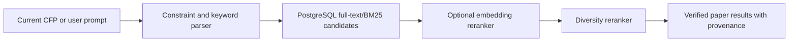

# Related Papers and Venue History: Product and Architecture Plan

> Implementation status (August 2, 2026): the expansion now covers 135 verified venues—20
> conferences, 104 journals, and 11 recurring workshops—with 51,304 papers in 290 edition/year
> groups. Exact DBLP stream/TOC, Crossref ISSN, and ACL Anthology event-volume adapters are
> implemented alongside sharded JSON/PostgreSQL repositories, APIs, search UI, automation,
> rollback, and tests. Operational instructions are in
> [`VENUE_HISTORY_IMPLEMENTATION.md`](VENUE_HISTORY_IMPLEMENTATION.md).

## 1. Product objective

The feature should answer a practical submission question:

> “What has this venue historically accepted, how has its focus changed, and which past papers are most relevant to the work I am considering submitting?”

It should not behave like a generic literature search engine. The differentiator is that every paper is connected to a verified conference edition, journal, workshop series, or special issue.

For example, clicking **Past work & venue fit** on IHCI 2026 should show:

- the earlier IHCI editions;
- the themes visible in each edition;
- papers verified as belonging to those proceedings;
- common research and evaluation methods;
- the papers most relevant to the current IHCI call or the user's typed research description;
- links to DBLP, the DOI/publisher page, and an open-access copy when one is known.

IHCI is a good pilot. The current official call describes human–AI interaction, explainability, robotics, computer vision, XR, accessibility, privacy, and responsible AI. The exact [DBLP IHCI series](https://dblp.org/db/conf/ihci/index.html) traces prior editions from 2009 onward. Earlier accepted work includes stress detection, multimodal interaction, mixed reality, privacy-preserving mental-health systems, human–robot relationships, and gaze estimation. This is the kind of historical evidence the product should expose.

## 2. Product experience

### Entry point

Add a secondary action to eligible CFP cards:

**Past work & venue fit →**

This is better than the label “Related papers” because the page does more than return similar papers. It explains the venue.

The action appears when at least one trustworthy historical source has been resolved. When no reliable history exists, the card can say **History not yet verified** rather than showing guessed results.

### Venue intelligence page

Use a route such as:

`/venues/ihci/related-work`

The page contains:

1. **Venue summary**
   - canonical venue name and acronym;
   - current call and deadline;
   - publisher/proceedings series;
   - years of verified historical coverage;
   - a coverage label: Verified, Partial, or Unavailable.

2. **What this venue publishes**
   - 5–10 recurring themes;
   - themes growing or declining across recent editions;
   - a short evidence-based summary with the analyzed years and paper count shown.

3. **How accepted work is done**
   - method tags such as user study, qualitative study, controlled experiment, benchmark, system paper, dataset, model, survey, field deployment, or mixed methods;
   - counts and examples for every method;
   - no method claim when the title/abstract does not provide enough evidence.

4. **Previous editions**
   - year-by-year timeline;
   - location, proceedings link, paper count, and major themes;
   - an edition can have multiple proceedings volumes.

5. **Accepted papers**
   - filters for year, theme, method, open access, and paper type;
   - sorting by relevance, recency, representative sample, or citations;
   - paper cards with title, authors, year, abstract excerpt, topics, method tags, DOI/publisher link, DBLP link, and open-access link.

6. **Search within this venue**
   - natural-language queries such as “trustworthy AI using a user study”;
   - the same interaction model as the existing hybrid dashboard search;
   - no manuscript is required.

7. **Optional paper-to-history comparison**
   - if the user voluntarily supplies a manuscript or abstract, compare it against the verified historical corpus;
   - do not persist manuscript text by default;
   - clearly separate “similar to prior work” from “likely to be accepted.”

### Default ranking modes

- **Relevant to the current call:** compares paper title, abstract, topics, and method tags with the current CFP.
- **Representative:** selects a diverse sample across the venue's major themes rather than twenty nearly identical papers.
- **Recent:** newest verified papers first.
- **Most cited:** an explicit optional sort, never the default.

Citation count should not be the default because it systematically favors older papers and popular subfields.

## 3. Coverage rules by venue type

### Conferences

Connect a stable conference series to exact proceedings editions. DBLP is the best first identity source for computer science, followed by official publisher proceedings and OpenReview accepted-paper records.

### Journals

Resolve the journal by ISSN and publisher identity. Show recent papers and theme trends over a configurable period, initially five years. A journal does not have “editions” in the conference sense, so the UI should use years, volumes, and issues.

### Special issues

Only label papers as belonging to a special issue when volume/issue metadata, an official table of contents, or a publisher relationship proves membership. If the system only finds topically similar papers from the parent journal, label them **Related papers from this journal**, not **Accepted in this special issue**.

### Workshops

Enable the feature only for repeat workshop series with a verified series identifier or official proceedings history. One-off workshops should not be merged merely because their titles contain similar words.

## 4. Integrity model

The system needs two different confidences:

1. **Venue identity confidence:** Is this historical series the same venue as the live CFP?
2. **Paper membership confidence:** Was this paper actually part of that edition, issue, or workshop?

### Evidence order

For conference and workshop membership:

1. exact DBLP stream and proceedings table of contents;
2. official publisher proceedings;
3. an official OpenReview accepted-paper invitation/group;
4. exact DOI proceedings metadata from Crossref/OpenAlex;
5. fuzzy name matching only as a candidate for review, never as published evidence.

For journals:

1. ISSN plus publisher identity;
2. OpenAlex source identifier;
3. Crossref container and DOI metadata.

Every paper stores its membership source and confidence. The frontend may display **Accepted at this venue** only for verified membership.

This would also fix a weakness visible in the current IHCI record: the generic proceedings check found an unrelated Nordic HCI item, while the exact DBLP stream contains the real IHCI history. Exact identifiers prevent acronym and title collisions.

## 5. Recommended source strategy

### DBLP: identity and proceedings membership

Use DBLP as the primary computer-science venue map. It has stable streams such as `conf/ihci`, exact edition records, tables of contents, and CC0 metadata. DBLP reports open bibliographic data for thousands of conference and journal series.

### Publisher and official proceedings: confirmation

Use Springer, ACM, IEEE, ACL Anthology, USENIX, and other official proceedings pages to corroborate edition identity and resolve DOI/paper links. IHCI, for example, has an official [Springer conference series](https://link.springer.com/conference/ihci).

### OpenAlex: enrichment and journal retrieval

Use OpenAlex for abstracts, topics, citation counts, open-access locations, source identifiers, and filtering works by source. Its current API provides a free allowance with an API key, but usage is credit-limited, so queries must be batched and cached. See the official [OpenAlex API and authentication documentation](https://developers.openalex.org/api-reference/authentication).

### Crossref: DOI and container verification

Use Crossref to normalize DOI metadata and verify journal/container identity. Its REST API supports filters including exact `container-title`, ISSN, ISBN, DOI, and relationships. See the official [Crossref REST filter documentation](https://www.crossref.org/documentation/retrieve-metadata/rest-api/rest-api-filters/).

### Semantic Scholar: optional relevance enrichment

Use Semantic Scholar as an optional enrichment/reranking provider, not the membership source of truth. It exposes paper search, citation data, SPECTER2 embeddings, and paper recommendations. Its authenticated introductory limit is currently one request per second, so batch operations and caching are required. See the official [Semantic Scholar API overview](https://www.semanticscholar.org/product/api).

### OpenReview: accepted-paper evidence when available

For venues with public historical groups, ingest accepted submissions from the exact venue/edition group. Do not assume that every submitted OpenReview paper was accepted.

## 6. Data architecture

The existing `cfps.json` stores call instances. A call instance should reference a stable venue instead of also pretending to be the venue's long-term identity.

Use managed PostgreSQL for historical literature data. The existing JSON files can remain the pipeline snapshots for current calls during migration.

### Core tables

```text
venues
  id, canonical_name, acronym, venue_type, status

venue_aliases
  venue_id, alias, source, valid_from, valid_to

venue_external_ids
  venue_id, provider, external_id, confidence, verified_at
  Examples: DBLP stream, OpenAlex source, ISSN, publisher series

venue_editions
  id, venue_id, year, title, location, starts_at, ends_at,
  proceedings_url, verification_status

papers
  id, doi, title, abstract, publication_date, citation_count,
  publisher_url, open_access_url

paper_external_ids
  paper_id, provider, external_id

edition_papers
  edition_id, paper_id, membership_source,
  membership_confidence, membership_status

paper_authors
  paper_id, author_position, author_name, orcid

paper_features
  paper_id, topics_json, method_tags_json, embedding,
  model_version, generated_at

venue_insights
  venue_id, start_year, end_year, paper_count,
  themes_json, methods_json, source_hash, generated_at

ingestion_runs
  id, provider, venue_id, state, cursor, started_at,
  finished_at, error_summary
```

### Important indexes

- unique DOI when present;
- unique provider/external ID;
- `(venue_id, year)` for editions;
- `(edition_id, paper_id)` for membership;
- full-text index across paper title and abstract;
- vector index only when embeddings are introduced;
- trigram index for controlled identity-resolution candidates.

### Deduplication order

1. DOI;
2. exact provider ID such as DBLP key or OpenAlex work ID;
3. publisher ID;
4. normalized title + year + first author as a cautious fallback.

Fuzzy title matching must never silently merge records with conflicting DOIs.

## 7. Codebase structure

Keep source-specific behavior behind adapters:

```text
lib/venue-history/
  identity.js
  membership.js
  normalize-paper.js
  rank-papers.js
  extract-methods.js
  build-insights.js

lib/venue-history/providers/
  dblp.js
  openalex.js
  crossref.js
  openreview.js
  semantic-scholar.js
  springer.js

scripts/
  resolve-venue-identities.mjs
  sync-venue-editions.mjs
  sync-venue-papers.mjs
  enrich-paper-metadata.mjs
  build-venue-insights.mjs

app/api/venues/[venueId]/
  history/route.js
  papers/route.js
  insights/route.js

app/venues/[venueId]/related-work/
  page.jsx

components/venue-history/
  VenueHistoryHeader.jsx
  ThemeTimeline.jsx
  MethodBreakdown.jsx
  EditionPicker.jsx
  RelatedPaperSearch.jsx
  PaperResultCard.jsx
  CoverageNotice.jsx
```

### Configuration without per-venue friction

Provider behavior belongs in a source configuration file:

```json
{
  "providers": {
    "dblp": { "enabled": true, "priority": 1 },
    "openalex": { "enabled": true, "priority": 3 },
    "crossref": { "enabled": true, "priority": 3 },
    "semanticScholar": { "enabled": false, "priority": 4 }
  }
}
```

Do not manually configure all 987 conferences. The identity resolver should generate mappings automatically. A small override file handles only ambiguous cases:

```json
{
  "ihci": {
    "dblpStream": "conf/ihci",
    "springerSeries": "ihci"
  }
}
```

When a new venue enters the current watchlist:

1. create or find its stable venue record;
2. attempt exact provider resolution;
3. auto-approve high-confidence matches;
4. put ambiguous matches in a backend review queue;
5. show no related-work feature until history is verified.

This resolver is now implemented as three config layers. Manual exceptions stay in
`data/venue-history-config.json`; reusable admission and coverage rules stay in
`data/venue-history-expansion-policy.json`; and `npm run expand:venue-history` writes the verified
`data/venue-history-catalog.json`. The current catalog includes exact recurring DBLP and ACL
series plus Q1/Q2 journal cards that have one unambiguous Crossref title, approved publisher
family, and valid ISSN. Ambiguous registry matches are rejected instead of receiving an
approximate history.

### How to restructure the current codebase without breaking it

The important design choice is **not** to rewrite the working dashboard around the new feature. The current system is good at one job: the scheduled pipeline produces reviewed JSON snapshots, `lib/cfp.js` filters and deduplicates them, `/api/cfps` exposes them, and the React dashboard renders them. Venue history is a different, larger, slower-moving dataset. It should be attached beside that path rather than inserted into the middle of it.

Use a strangler migration: create clean boundaries around the existing behavior, add the history subsystem behind those boundaries, and move one responsibility at a time. At every stage the old path remains deployable.

#### Keep these contracts stable

The first implementation must preserve:

- the shape and behavior of `GET /api/cfps`;
- the existing IDs, deadline lifecycle rules, deduplication, ranking filters, and card rendering;
- `data/cfps.json` and the existing two-day discovery pipeline as the source of truth for current calls;
- the existing tab names and default dashboard route;
- the current LLM routes and manuscript opt-in behavior;
- the rule that browser requests never trigger hundreds of provider calls.

This means the related-papers feature can fail, be disabled, or have partial coverage without stopping the CFP dashboard.

#### Target module boundaries

Refactor toward the following structure gradually:

```text
lib/
  calls/
    repository.js          # interface used by API routes
    json-repository.js     # wraps today's cfps.json behavior
    lifecycle.js           # existing exact-time expiry rules
    dedupe.js              # existing duplicate protection
  venues/
    identity.js            # stable venue IDs and aliases
    repository.js
  venue-history/
    repository.js          # edition/paper/insight reads
    service.js             # product-level use cases
    rank-papers.js
    providers/
      dblp.js
      openalex.js
      crossref.js
      openreview.js
      publisher.js
  shared/
    safe-fetch.js
    public-links.js
    prompt-security.js
    api-security.js
```

This is a target, not a request to move every file immediately. Prematurely renaming all current modules would create a large diff with no product value. Start by adding repository interfaces and small adapter files that call the existing modules.

For example:

```js
// New boundary; initial implementation delegates to today's tested behavior.
export const currentCallRepository = {
  listActive(now) {
    return getActiveCFPs(now);
  },
};
```

The route can switch from calling `getActiveCFPs()` directly to calling `currentCallRepository.listActive()` with no change to its response. Later, the repository implementation can change without changing the route or React components.

#### Separate a call from a venue

Today a CFP row effectively represents both “IHCI 2026 is open” and “IHCI is a recurring venue.” The migration should add an optional stable reference:

```json
{
  "id": "ihci-2026",
  "venueId": "ihci",
  "name": "Intelligent Human Computer Interaction 2026",
  "deadline": "..."
}
```

Do not replace the current `id`; UI keys, deduplication, saved links, and tests may depend on it. `venueId` is additive. A generated alias map can attach it during the pipeline:

```text
data/venue-identity-overrides.json
```

The database owns stable venues and history. The JSON record only stores the reference needed to join the current call to that history.

#### Introduce storage additively

PostgreSQL is needed for papers, editions, provenance, full-text search, pagination, and concurrent background updates. It does not need to replace the JSON call store in the first release.

The first database migration only creates new tables. It does not alter or delete current data. New history API routes read PostgreSQL; existing call routes read JSON. The card receives a lightweight `historyCoverage` value from a precomputed availability snapshot or a small batched database query.

Never perform one database query per card. Resolve coverage for all visible `venueId` values in one query, or publish a compact map:

```json
{
  "ihci": { "status": "verified", "paperCount": 142, "editionCount": 8 }
}
```

#### Migration sequence

1. **Freeze behavior with characterization tests.** Save representative `/api/cfps`, book-call, reviewer-call, and workshop-proposal outputs. Test expiry, deduplication, safe links, rankings, and OpenReview recovery.
2. **Add repository facades.** Routes call interfaces whose first implementations delegate to the existing functions. There is no data or UI change.
3. **Add optional `venueId`.** Generate it for high-confidence identities; leave it absent for ambiguous entries. Existing cards ignore it.
4. **Create history tables and provider adapters.** Backfill IHCI in a separate script first; after
   shadow validation, attach an incremental history step to the end of the two-day CFP job without
   changing discovery, deadline, or admission behavior.
5. **Run shadow validation.** Build IHCI history in staging, compare paper membership against DBLP/publisher records, and expose no public button yet.
6. **Add read-only history APIs.** Validate parameters, paginate, cache public responses, and return provenance with each result.
7. **Add the page behind `VENUE_HISTORY_ENABLED=1`.** With the flag off, the build and dashboard behave exactly as before.
8. **Enable only verified venues.** A card shows the action only when `venueId` exists and coverage is `verified` or explicitly `partial`.
9. **Expand in batches.** Add active conferences, then journals and special issues, then verified repeat workshops.
10. **Retire adapters only after parity.** The original functions are removed only when their replacement has matching tests and at least one successful production cycle.

#### Compatibility and rollback

Use additive database migrations: create columns as nullable, backfill, verify, then add constraints in a later migration. Never combine a destructive schema change and an application deployment.

Each release needs:

- a feature flag for the new page and card action;
- API contract tests for old endpoints;
- provider fixtures so tests do not depend on the live internet;
- database migration tests against an empty database and a previous-version snapshot;
- a shadow-mode report for venue mappings and paper counts;
- metrics for failed identity matches, paper-membership conflicts, and empty histories.

Rollback is simple because current calls still use JSON: turn off `VENUE_HISTORY_ENABLED`, deploy the prior application version if necessary, and leave the additive history tables intact. No current CFP data needs to be restored.

#### Why this structure was chosen

This approach limits the blast radius. A history-provider outage can make one new page stale, but it cannot make deadlines, OpenReview calls, or the main dashboard disappear.

Two alternatives were considered:

1. **Rewrite all call storage into PostgreSQL first.** This could create a cleaner final architecture, but it couples the new feature to a risky migration of already-working lifecycle logic. It was dropped for the first release because it produces no immediate user benefit and makes rollback harder.
2. **Put historical papers directly into `cfps.json`.** This looks easy for IHCI but scales badly: the file would become huge, every refresh would rewrite it, filtering and pagination would be awkward, and closed-call pruning could accidentally delete the long-term venue identity. It was dropped because call instances and scholarly history have different lifecycles.

## 8. Retrieval and ranking

### Default retrieval

Retrieve only papers with verified membership in the selected venue. The current CFP title, topics, domain, and call text become the default query.

### Recommended ranking

Start with:

- BM25/title and abstract relevance;
- overlap with current CFP topics;
- method match;
- modest recency boost;
- diversity reranking so results cover several themes.

Embeddings should be a second-stage reranker, not the only retrieval mechanism. The existing hybrid-search approach can inspire query parsing, but paper retrieval should live in its own module because a corpus of papers has different fields and scale.

Suggested flow:



### Theme and method analysis

Use a controlled taxonomy plus deterministic signals first. An optional LLM may summarize already-extracted evidence, but it must not invent methods from titles alone.

Rules:

- process title and abstract metadata, not copyrighted full text by default;
- store the model/prompt version;
- show the source papers behind every aggregate;
- regenerate insights when the underlying paper/source hash changes;
- if abstracts are missing, report reduced coverage.

## 9. API behavior

Suggested endpoints:

```text
GET /api/venues/:id/history
GET /api/venues/:id/insights
GET /api/venues/:id/papers?year=&topic=&method=&q=&sort=&cursor=
POST /api/venues/:id/compare
```

The read endpoints return precomputed data and use cursor pagination. They should never fan out to DBLP/OpenAlex/Semantic Scholar during a browser request.

Cache public venue pages at the CDN/API layer. Invalidate the cache after a successful background refresh.

## 10. Pipeline and scaling

The CFP pipeline continues every two days. Historical proceedings change more slowly, but a newly
admitted conference should not wait up to a week before its previous work appears. The implemented
design therefore has a small change-triggered sync and a separate full-refresh cadence.

### Recommended cadence

- current CFP and deadline pipeline: every two days;
- newly admitted or missing conference history: at the end of that same two-day backend run;
- full venue-history metadata refresh: weekly;
- older proceedings metadata: monthly or only when a source reports a change;
- insights rebuild: only when the paper set or metadata changes;
- failed exact-source fetches: recorded in a pending queue and retried on the next two-day run.

No provider call runs when a user opens a venue. The page reads only verified precomputed data, so
browser latency and availability are independent of DBLP, Crossref, ACL Anthology, and OpenAlex.

### Coverage rollout

1. Backfill IHCI and 10 representative venues.
2. Backfill all currently open conferences.
3. Add journals and special issues using ISSN/source identity.
4. Expand to the full ranked watchlist in bounded batches.
5. Enable repeat workshops only after exact series resolution.

For 100–200 users, this remains a read-heavy system. Precomputed insights, cursor pagination, and CDN caching matter more than complicated distributed infrastructure.

## 11. Privacy and security

- The default experience requires no manuscript.
- User search prompts should not be permanently stored unless product analytics explicitly require it.
- Manuscript comparison remains opt-in and should not persist raw manuscript text by default.
- Provider API keys remain server-side environment variables.
- Reuse the SSRF-safe remote fetch layer, including validation of every redirect and DNS pinning so the request can connect only to the public IP addresses that were approved.
- Keep database tables default-deny to anonymous clients with Row Level Security;
  only the backend owner/service role receives the database connection secret.
- Pin CI actions to immutable commits, audit installed dependencies before secrets
  enter a step, and serialize workflows that write the same snapshots.
- Add provider-specific timeouts, exponential backoff, circuit breakers, and request budgets.
- Treat pipeline JSON and provider metadata as untrusted at the API boundary. Only `http` and `https` URLs may become clickable links.
- Sanitize abstracts and metadata before rendering. React text rendering is safe by default; do not introduce raw HTML rendering for abstracts or paper titles.
- Treat manuscripts, user prompts, and fetched pages as untrusted data inside LLM prompts. Delimit them, instruct the model not to follow embedded instructions, and never accept model-generated links as trusted links.
- Validate model output against a schema before returning it. Venue IDs must resolve to an active server-side record, and clickable URLs must come from that record rather than the model.
- Apply strict upload and response-size limits, PDF type/signature checks, request timeouts, bounded concurrency, and per-route rate limits.
- Keep administrative batch operations behind a long random token using constant-time comparison. For multiple application instances, move rate-limit counters from memory to Redis or another shared store.
- Send CSP, clickjacking, MIME-sniffing, referrer, permissions, cross-origin, and HSTS headers. HSTS is production-only so local HTTP development remains usable.
- Run `npm audit --omit=dev` in CI and use dependency update automation. A successful audit means no advisories are known for that exact dependency snapshot; it is not a permanent guarantee.
- Link to full text; do not copy or republish publisher PDFs.
- Show attribution required by each provider's license.

### Security work completed during this architecture review

The current code was audited rather than treating security only as a future requirement. The following concrete changes were made:

- upgraded Next.js from 15.5.20 to 15.5.22 to address the published framework advisories affecting the installed version;
- pinned patched PostCSS, Sharp, and brace-expansion versions and regenerated the lockfile;
- reached zero known vulnerabilities in both the full `npm audit` and production-only audit at the time of review;
- changed remote fetching so DNS is resolved and checked once per redirect hop and the connection is pinned to those approved public addresses, closing the DNS-rebinding gap;
- sanitized all public dashboard link fields at the API/data-loader boundary, including nested OpenReview track links;
- removed model-generated template links from the trust path—recommendation links now come only from the exact sanitized venue record;
- added shared prompt-injection protection for manuscript analysis, venue comparison, draft review, extension analysis, reference extraction, deadline extraction, and legitimacy review;
- bounded LLM response bodies before JSON parsing;
- added production HSTS and additional cross-origin/resource headers while preserving the existing CSP, frame, MIME, referrer, and permissions protections;
- extended the security regression tests.

Security cannot honestly be declared “solved forever.” New advisories, deployment mistakes, provider changes, and future code can create new risks. The enforceable standard is: no known dependency advisories in the reviewed snapshot, all identified code-level findings patched, regression tests added, secrets kept out of the repository, and audits rerun in CI and before deployment.

## 12. Design decisions and alternatives

| Decision | Recommended choice and why | Alternative 1 and why dropped | Alternative 2 and why dropped |
|---|---|---|---|
| Product surface | A dedicated venue intelligence page reached from each card. It supports timelines, filters, and shareable URLs. | Modal/drawer: too cramped for editions, themes, methods, and pagination. | New global “Papers” tab: loses the connection to the venue the user is evaluating. |
| Identity model | Stable venue plus separate editions and current calls. Prevents acronym collisions and supports journals/workshops correctly. | Add historical fields directly to `cfps.json`: repeats data and loses history when closed calls are pruned. | Treat every year as an unrelated venue: makes trend analysis and aliases unreliable. |
| Storage | Managed PostgreSQL, with full-text search first and optional `pgvector`. Handles normalized relations, provenance, and hundreds of thousands of papers. | Continue with JSON: simple, but large rewrites, weak querying, and poor concurrency become unacceptable. | Vector database only: good for similarity, poor for exact proceedings membership, years, DOI uniqueness, and relational integrity. |
| Source of truth | DBLP/official proceedings for membership, then OpenAlex/Crossref for enrichment. Separates “accepted here” from “topically similar.” | Semantic Scholar alone: useful enrichment but venue strings are not strong enough for exact membership in all cases. | Search engine/LLM scraping: broad coverage but nondeterministic, difficult to audit, and vulnerable to fabricated venue relationships. |
| Ingestion | Background batch sync plus lazy backfill. Keeps page loads fast and respects provider budgets. | Live API fan-out when a card is clicked: slow, fragile, and expensive; one provider outage breaks the page. | Eagerly backfill every venue and every year immediately: unnecessary first-release cost and makes source-resolution errors harder to inspect. |
| Search | BM25/full-text candidates plus optional embeddings and diversity reranking. Exact terms and semantic similarity both work. | BM25 only: strong MVP and fallback, but misses paraphrases and conceptual similarity. | LLM-only ranking: expensive, slow, hard to reproduce, and may ignore exact constraints. |
| Theme/method extraction | Controlled taxonomy with deterministic evidence; optional LLM summary over abstracts. Auditable and useful without requiring full text. | Keyword counts only: cheap but produces shallow themes and weak descriptions of methods. | Full-text LLM analysis: richer, but creates copyright, cost, privacy, and provenance problems. |
| Refresh cadence | Two-day CFP refresh with an incremental sync only for new/missing exact venue identities, plus a weekly full history refresh and change-triggered insight rebuild. New calls get useful context quickly without recomputing the whole corpus. | Run the full history corpus every two days: wastes API budgets and recomputes unchanged proceedings. | Refresh only on click: inconsistent latency, provider-dependent pages, and no predictable coverage. |
| Workshop policy | Enable only for verified repeat series. Avoids merging unrelated one-off workshops. | Hide all workshops: safe but discards valuable recurring series such as established ACL/CV workshops. | Match workshops by title similarity: high false-positive risk because workshop names and acronyms are frequently reused. |

## 13. Phased implementation plan

### Phase 1: IHCI proof of concept

- introduce stable venue, edition, paper, and membership tables;
- map IHCI to the exact DBLP stream and Springer series;
- ingest 2022–2025 editions and paper metadata;
- build the page, edition timeline, paper list, coverage notice, and BM25 search;
- verify every visible paper against a proceedings membership source.

Success criteria:

- no HCI/HCII/IHCI acronym collision;
- every “accepted at IHCI” paper has exact membership evidence;
- the page explains its themes and methods with source-paper links;
- no external API call is required during page rendering.

### Phase 2: active conference coverage

- auto-resolve stable identities for currently open conferences;
- add DBLP, OpenReview, OpenAlex, Crossref, and publisher adapters;
- add relevance, representative, recent, and most-cited modes;
- add a review queue for ambiguous venue mappings.

### Phase 3: journals and special issues

- add ISSN/OpenAlex-source mappings;
- represent volumes, issues, and verified special-issue membership;
- add five-year journal theme and method trends.

### Phase 4: full watchlist and repeat workshops

- backfill the ranked watchlist in bounded batches;
- introduce optional embedding reranking;
- enable only verified repeat workshop series;
- monitor coverage, source errors, query latency, and API-credit usage.

## 14. Metrics to evaluate the product

- percentage of active venues with verified history;
- percentage of displayed papers with exact membership evidence;
- paper link success rate;
- venue-identity false-positive rate;
- related-work page open rate from CFP cards;
- search-to-paper-click rate;
- use of edition/theme/method filters;
- latency from clicking the feature to useful results;
- percentage of summaries with accessible supporting abstracts;
- number of venue mappings requiring human review.

The most important quality metric is not the number of papers found. It is the percentage of displayed papers that can be proven to belong to the claimed venue or issue.
