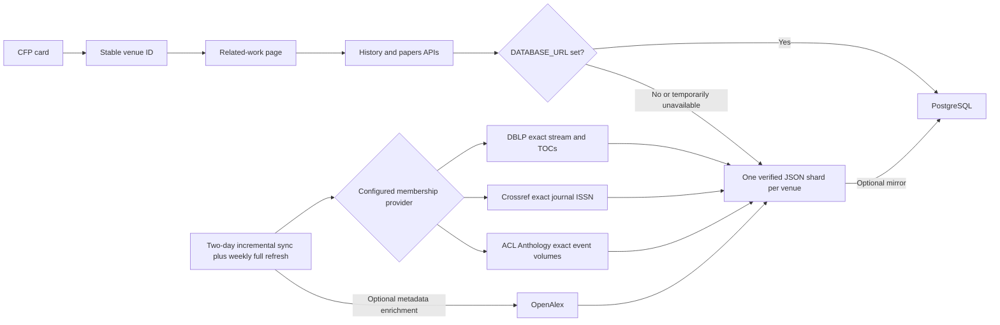

# Venue History and Related Papers: Operating Guide

## What is live now

Verified history is implemented for 135 venues: 20 conferences, 104 journals, and 11 recurring workshops. Of those, 134 currently have a live dashboard card. An eligible CFP card shows **Past work & venue fit** and opens a dedicated page containing:

- 290 prior conference/workshop editions or journal publication-year groups;
- more than 50,000 papers with exact source membership;
- recurring topic and method summaries;
- search using normal keywords or a sentence describing the work;
- year, theme, method, and open-access filters plus several ranking modes;
- DBLP, ACL Anthology, Crossref, DOI, publisher, and verified open-access links when applicable.

Conference coverage includes IHCI, KDD, IUI, WSDM, FAccT, ICAIF, EACL, WACV, ICWSM,
NeurIPS, CHI, SIGMOD, AAMAS, ICASSP, DAI, INLG, NLDL, TAAI, BNAIC/BeNeLearn, and IEEE
BSN. Journal coverage includes the three initial philosophy/ethics journals plus 101 exact-ISSN
Q1/Q2 journals from ACM, IEEE, Springer Nature, Elsevier, MDPI, Wiley, and Taylor & Francis.
Repeat-workshop coverage adds ArabicNLP, WOAH, WMT, NLLP, BlackboxNLP, UncertaiNLP, BabyLM,
and GeBNLP to FinNLP, MRL, and DASIP.

The remaining live conference cards are predominantly one-off community OpenReview groups with
no authoritative recurring proceedings identity. They intentionally receive no history link.
Seventeen journal candidates were also rejected because Crossref did not return one unambiguous
title + publisher + ISSN match.

The normal dashboard still reads current calls from `data/cfps.json`. Historical papers are separate, so pruning a closed CFP cannot delete venue history.

## How the request flows



No provider is contacted during a page request. The browser reads precomputed data, so a DBLP, Crossref, ACL Anthology, or OpenAlex outage cannot break the page.

## Local setup

The feature works from the committed JSON snapshot with no database and no API key:

```bash
npm install
cp .env.example .env.local
npm run dev
```

Open the dashboard and use the IHCI card's **Past work & venue fit** action, or visit:

```text
http://localhost:3000/venues/ihci/related-work
```

Useful commands:

```bash
npm run test:venue-history
npm run expand:venue-history
npm run sync:venue-history -- --venue=ihci
npm run sync:venue-history -- --type=journal
npm run snapshot:conference-ids -- --output=/tmp/conferences-before.json
npm run sync:venue-history -- --new-conferences-from=/tmp/conferences-before.json --missing
npm run build
```

The sync contacts the configured DBLP, Crossref, and ACL Anthology providers, so it needs network access. `OPENALEX_API_KEY` is optional; without it, membership, titles, authors, years, DOI links, and title-based themes still work.

## Environment variables

```env
# On by default. Use 0 for immediate rollback.
VENUE_HISTORY_ENABLED=1

# Optional for the current single-instance/sharded-JSON release.
DATABASE_URL=
DATABASE_SSL=1
DATABASE_POOL_MAX=5

# Only needed when a database provider supplies a private CA certificate.
# Store the value as one line with literal \n characters.
DATABASE_CA_CERT=

# Optional enrichment; DBLP does not need this.
OPENALEX_API_KEY=

# Optional polite-pool contact and bounded journal concurrency.
CROSSREF_MAILTO=
CROSSREF_HISTORY_CONCURRENCY=2
JOURNAL_HISTORY_CONCURRENCY=2
```

`DATABASE_SSL=1` verifies the database certificate. Set it to `0` only for a database connection on a private network that explicitly does not support TLS.

## Adding another venue without changing core logic

There are three config layers:

- `data/venue-history-config.json` contains manual overrides and exceptional identities.
- `data/venue-history-expansion-policy.json` contains selection rules and curated exact-series entries.
- `data/venue-history-catalog.json` is generated by `npm run expand:venue-history` after exact registry checks.

Generated papers live in minified files under `data/venue-history-records/`. A request reads only
the requested venue's file rather than parsing all 50,000+ papers. `data/venue-history.json` is a
small manifest, and `data/venue-history-coverage.json` remains the homepage index.

Add one entry to `data/venue-history-config.json` with:

- a stable internal ID;
- exact call IDs/names/acronyms used by current CFP cards;
- an exact membership source: a DBLP stream, Crossref ISSNs, or ACL Anthology event slug;
- the history year range.

Then run the sync and tests. The identity resolver deliberately uses exact configured aliases. It does not guess from a similar acronym, because attaching another venue's accepted papers would be worse than showing no history.

Provider examples:

```jsonc
// Conference or recurring workshop with its own DBLP series
"externalIds": { "dblpStream": "conf/kdd" }

// Journal
"historyProvider": "crossref-journal",
"externalIds": { "issns": ["2730-5953", "2730-5961"] }

// Recurring ACL workshop
"historyProvider": "acl-anthology",
"externalIds": { "aclAnthologyEvent": "finnlp" }
```

Repeat workshops also support an exact `openreviewSeries` identity with the year removed. This lets a future edition match automatically while preventing the same short acronym under another parent conference from inheriting the history.

The catalog expansion command automatically considers Q1/Q2 journal cards. It admits a journal
only when normalized title, approved publisher family, and Crossref ISSN agree. Broad journal
entries retain up to 120 recent papers per year for 2024–2025; the UI labels this as representative
coverage. Established conferences are auto-admitted only when a ranked name uniquely matches a
configured DBLP stream. Ambiguous candidates remain in the catalog's rejection list.

The current implementation processes configured venues independently. If one source fails, the
last verified shard for that venue is retained. This makes expanding the config safe and prevents
a temporary provider outage from erasing good data.

## What happens when a new conference is added

The every-two-days backend pipeline now treats history as a change-triggered follow-up:

1. Before discovery, it saves the IDs of the conference cards already on the dashboard.
2. Discovery, verification, legitimacy checks, deadline pruning, and deduplication run normally.
3. It compares the final conference IDs with the saved list.
4. For each genuinely new conference, the catalog expansion step looks for an exact authoritative
   series identity. It does not accept an acronym-only guess.
5. If an identity is proven, only that venue's missing history shard is fetched. The browser never
   performs this network work.
6. If the provider is temporarily unavailable, the CFP remains on the dashboard, no unverified
   history button is shown, and `data/venue-history-pending.json` records the retry. The next two-day
   run retries missing shards.

This is deliberately incremental: adding one conference does not refetch more than 50,000 existing
papers. The weekly job remains responsible for a complete metadata refresh across all configured
venues.

## PostgreSQL and Render

PostgreSQL remains optional for a read-only deployment. The homepage reads a compact coverage index and a related-work request reads one venue shard. Use managed PostgreSQL when multiple application instances need freshly synced data without a redeploy.

On Render:

1. Create a PostgreSQL service and a Web Service for this repository.
2. Use `npm ci && npm run build` as the build command and `npm start` as the start command.
3. Set `NODE_VERSION=20`, `VENUE_HISTORY_ENABLED=1`, and the existing LLM variables only if the recommender is enabled.
4. Set `DATABASE_URL` to the managed database connection string if using PostgreSQL. Use `DATABASE_SSL=0` for a private Render connection that does not use TLS; otherwise keep `DATABASE_SSL=1`.
5. Run `npm run sync:venue-history` once from a Render job or locally against that database. The script applies `migrations/001_venue_history.sql` before mirroring the snapshot.
6. Keep both GitHub Actions workflows enabled. The main pipeline runs every two days and immediately
   fetches exact history for newly admitted or missing conferences; the weekly history workflow
   refreshes the complete corpus.

Do not run the network sync during every page request or every server startup. It increases latency, repeats work, and makes availability depend on external providers.

## Trust and security boundaries

- Conference papers require an exact DBLP stream and table of contents.
- Journal papers require an exact configured ISSN returned by Crossref.
- ACL workshops require an exact official event and volume in ACL Anthology.
- Crossref delivery links are not labeled open access; only a provider that explicitly confirms OA may set that label.
- Similar names are not auto-merged.
- All provider data is treated as untrusted text; the UI does not render raw HTML.
- Only validated HTTP(S) links are returned to the browser.
- Search prompts stay in the request and are not written to the snapshot or database.
- Provider and database secrets stay server-side.
- APIs validate venue IDs, bound query/filter lengths, cap page size, and use cursor pagination.
- Database TLS certificate verification is enabled by default.
- PostgreSQL history tables enable Row Level Security and have no anonymous/public
  policies; the backend owner/service role is the only intended database client.
- PostgreSQL JSON fields are serialized explicitly before parameterized writes.
- CI actions are commit-pinned, dependency advisories are audited, secrets are
  scoped to provider steps, and shared data writers are serialized.
- The feature flag provides a no-data-loss rollback.

Security is a maintained process, not a permanent state. Run the security test, dependency audit, and build in CI after dependency or deployment changes.

## Why these choices and what comes next

The system uses source-specific membership authorities because a conference series, journal ISSN, and workshop event are not interchangeable. OpenAlex remains enrichment rather than the membership authority. PostgreSQL is supported, while JSON remains a deployment fallback.

Two alternatives were considered:

- Live DBLP/OpenAlex calls when the page opens were rejected because they make the UI slow and fragile.
- A vector database as the primary store was rejected because similarity cannot prove venue membership and is awkward for years, editions, DOIs, and provenance.

The next controlled expansion is exact special-issue membership and additional established
conference series as authoritative proceedings identities become available. One-off community
OpenReview groups remain intentionally unmapped unless they have a provable recurring series.
Embeddings can later rerank BM25 candidates, but are not required to make keyword and
natural-language searches useful at the current corpus size.
